Horizon은 클라우드 관리자와 사용자들이 다양한 OpenStack 자원과 서비스를 관리할 수 있는 웹 인터페이스입니다. OpenStack Horizon은 어떻게 사용자를 인증, 인가하고 Keystone과 연동할까요? 이에 대한 과정을 시퀀스 다이어그램과 코드를 통해 알아봅시다.

# OpenStack Horizon 인증 과정 요약

|     | 과정                                                                                                                            |
| --- | ------------------------------------------------------------------------------------------------------------------------------- |
| 1   | Horizon은 Django의 인증 로직을 커스터마이징하여 Keystone과 연동한다.                                                            |
| 2   | Keystone에서는 크게 2가지 유형의 토큰을 발급한다. (Unscoped 토큰, Scoped 토큰)                                                  |
| 3   | Unscoped 토큰은 Keystone이 인증된 사용자에 대해 발급하는 신분 증명용 토큰으로 Scoped 토큰을 발급받기 위해 사용된다.             |
| 4   | Scoped 토큰을 발급받는 이유는 Unscoped 토큰만으로는 서비스(e.g. Nova)에 요청할 수 없기 때문이다.                                |
| 5   | Scoped 토큰은 클라이언트(e.g. 유저, Nova, Glance)가 실행할 수 있는 범위가 담겨있는 토큰으로 서비스(e.g. Nova)에 요청할 수 있다. |
| 6   | 결국, Keystone 연동에서의 핵심은 Scoped 토큰을 발급받는 것이다.                                                                 |
| 7   | 사용자가 인증되면 Horizon은 Unscoped 토큰을 세션에 저장한다. (추후 Scoped 토큰을 발급 받기 위해)                                |
| 8   | 세션에 저장된 Unscoped 토큰을 이용해 Scoped 토큰을 발급 받는다.                                                                 |
| 9   | 발급 받은 Scoped 토큰과 함께 서비스(e.g. Nova)에 요청한다.                                                                      |

# 사용자 로그인 (시퀀스 다이어그램)

Horizon은 Django 인증 시스템을 통해 사용자를 인증합니다. 인증 과정 중 Keystone과 연동하기 위해 Custom 인증이 추가되어 있는데, 이를 `settings.py`의 `AUTHENTICATION_BACKENDS` 옵션을 통해 확인할 수 있습니다. Custom 인증의 핵심은 Keystone에서 Unscoped 토큰을 발급받는 것으로, `openstack_auth.backend.KeystoneBackend` 모듈에서 진행합니다. Unscoped 토큰이 성공적으로 발급되면 해당 토큰을 Django Session에 저장합니다.

아래는 이러한 사용자 로그인 과정을 시퀀스 다이어그램으로 표현하였습니다.

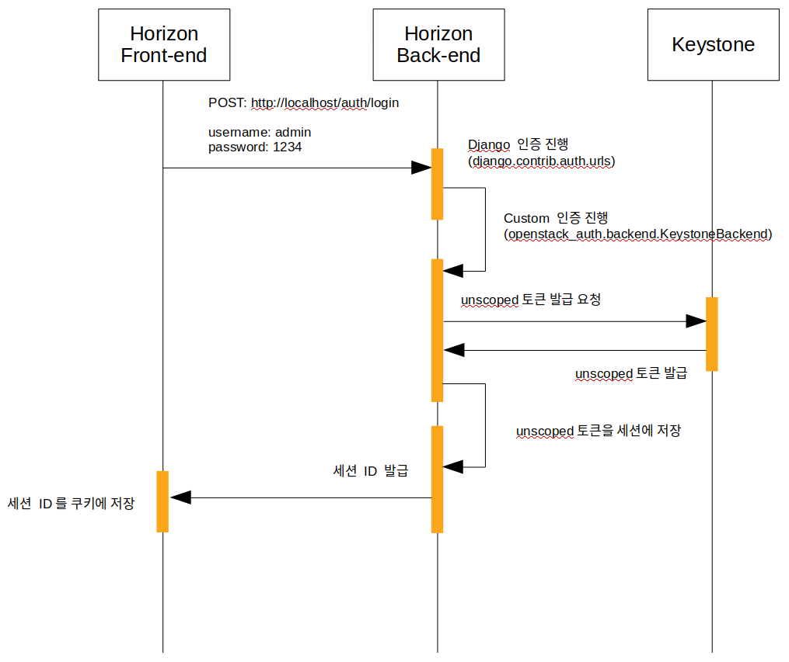

[그림 1] 사용자 로그인 시퀀스 다이어그램

# 코드로 알아보자

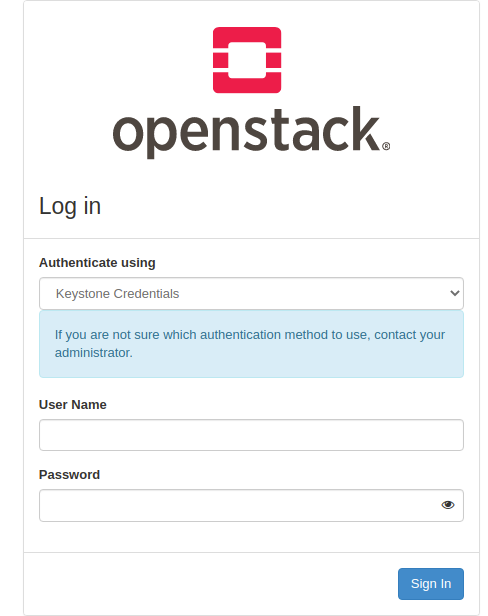

Horizon 콘솔에서 User Name과 Password를 입력하고 [Sign In] 버튼을 누르면

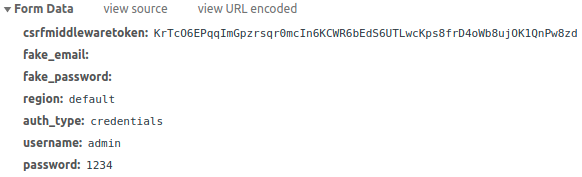

POST Method로 파라미터와 함께 http://localhost/auth/login URL을 요청합니다.

## Horizon (Back-end)

#### horizon/openstack_auth/urls.py

```python
urlpatterns = [
  url(r"^login/$", views.login, name='login'),

  ...

]
```

#### horizon/openstack_dashboard/settings.py

```python
AUTHENTICATION_BACKENDS = ('openstack_auth.backend.KeystoneBackend',)
```

`AUTHENTICATION_BACKENDS` 옵션을 통해 Django 인증 시스템을 이용해 인증 시, 추가적인 인증 로직을 실행할 수 있습니다. 이러한 추가적인 인증을 Custom 인증이라 부릅니다.

#### horizon/openstack_auth/views.py

```python
from django.contrib.auth import views as django_auth_views

...

@sensitive_post_parameters()
@csrf_protect
@never_cache
def login(request):

  ...

  try:
    res = django_auth_views.LoginView.as_view(
      template_name=template_name,
      redirect_field_name=auth.REDIRECT_FIELD_NAME,
      form_class=form,
      extra_context=extra_context,
      redirect_authenticated_user=False)(request)
  except exceptions.KeystonePassExpiredException as exc:
    res = django_http.HttpResponseRedirect(
      reverse('password', args=[exc.user_id]))
    msg = _("Your password has expired. Please set a new password.")
    res.set_cookie('logout_reason', msg, max_age=10)
```

`django_auth_views.LoginView.as_view()` 를 호출하면 Django 인증 시스템이 실행됩니다. 그 후 `AUTHENTICATION_BACKENDS` 옵션에 따라 Custom 인증인 `openstack_auth.backend.KeystoneBackend` 모듈을 호출합니다. `openstack_auth.backend.KeystoneBackend` 모듈의 핵심은 Unscoped 토큰을 Keystone에게서 발급 받는 것으로, 모듈이 호출되면 Unscoped 토큰 발급 요청을 진행합니다.

#### horizon/openstack_auth/backend.py

```python
# TODO(stephenfin): Subclass 'django.contrib.auth.backends.BaseBackend' once we
# (only) support Django 3.0
class KeystoneBackend(object):
  """Django authentication backend for use with ``django.contrib.auth``."""

  ...

  def authenticate(self, request, auth_url=None, **kwargs):
    """Authenticates a user via the Keystone Identity API."""
    LOG.debug('Beginning user authentication')

    if not auth_url:
      auth_url = settings.OPENSTACK_KEYSTONE_URL

    auth_url, url_fixed = utils.fix_auth_url_version_prefix(auth_url)
    if url_fixed:
      LOG.warning("The OPENSTACK_KEYSTONE_URL setting points to a v2.0 "
                  "Keystone endpoint, but v3 is specified as the API "
                  "version to use by Horizon. Using v3 endpoint for "
                  "authentication.")

    plugin, unscoped_auth = self._get_auth_backend(auth_url, **kwargs)

    ...
```

Custom 인증 모듈의 클래스에는 authenticate 메서드가 있어야 합니다. Django 인증 시스템이 Custom 인증을 실행할 때 authenticate 메서드를 호출합니다.

토큰 발급과 관련된 모듈은 2개로 아래와 같습니다.

- keystoneauth1
- keystoneclient

#### horizon/openstack_auth/backend.py

```python
from openstackit.openstack_auth import user as auth_user

...

# TODO(stephenfin): Subclass 'django.contrib.auth.backends.BaseBackend' once we
# (only) support Django 3.0
class KeystoneBackend(object):
  """Django authentication backend for use with ``django.contrib.auth``."""

  ...

  def authenticate(self, request, auth_url=None, **kwargs):

    ...

    # If we made it here we succeeded. Create our User!
    unscoped_token = unscoped_auth_ref.auth_token

    user = auth_user.create_user_from_token(
        request,
        auth_user.Token(scoped_auth_ref, unscoped_token=unscoped_token),
        endpoint,
        services_region=region_name)

    if request is not None:
      # if no k2k providers exist then the function returns quickly
      utils.store_initial_k2k_session(auth_url, request, scoped_auth_ref,
                                      unscoped_auth_ref)
      request.session['unscoped_token'] = unscoped_token
      if domain_auth_ref:
        # check django session engine, if using cookies, this will not
        # work, as it will overflow the cookie so don't add domain
        # scoped token to the session and put error in the log
        if utils.using_cookie_backed_sessions():
          LOG.error('Using signed cookies as SESSION_ENGINE with '
                    'OPENSTACK_KEYSTONE_MULTIDOMAIN_SUPPORT is '
                    'enabled. This disables the ability to '
                    'perform identity operations due to cookie size '
                    'constraints.')
        else:
          request.session['domain_token'] = domain_auth_ref

      request.user = user

      ...
```

Unscoped 토큰 발급이 성공적으로 이루어지면 auth_user.create_user_from_token() 함수를 호출해 User 인스턴스를 생성하고, 만들어진 User 인스턴스를 request.user에 저장합니다. 또한, Unscoped 토큰은 `request.session['unscoped_token'] = unscoped_token` 코드에 의해 Session에 저장됩니다.

#### horizon/openstack_auth/user.py

```python
def create_user_from_token(request, token, endpoint, services_region=None):
  # if the region is provided, use that, otherwise use the preferred region
  svc_region = services_region or \
    utils.default_services_region(token.serviceCatalog, request, endpoint)
  return User(id=token.user['id'],
              token=token,
              user=token.user['name'],
              password_expires_at=token.user['password_expires_at'],
              user_domain_id=token.user_domain_id,
              # We need to consider already logged-in users with an old
              # version of Token without user_domain_name.
              user_domain_name=getattr(token, 'user_domain_name', None),
              project_id=token.project['id'],
              project_name=token.project['name'],
              domain_id=token.domain['id'],
              domain_name=token.domain['name'],
              enabled=True,
              service_catalog=token.serviceCatalog,
              roles=token.roles,
              endpoint=endpoint,
              services_region=svc_region,
              is_federated=getattr(token, 'is_federated', False),
              unscoped_token=getattr(token, 'unscoped_token',
                                    request.session.get('unscoped_token')))
```

`create_user_from_token()` 함수는 User 인스턴스를 생성해 Return 합니다.

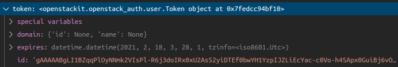

[그림 4] token 파라미터 값 (openstackit.openstack_auth.user.Token 자료형)

#### horizon/openstack_auth/views.py

```python
from openstack_auth import user as auth_user

...

@sensitive_post_parameters()
@csrf_protect
@never_cache
def login(request, template_name=None, extra_context=None, **kwargs):

  ...

  # Set the session data here because django's session key rotation
  # will erase it if we set it earlier.
  if request.user.is_authenticated:
    auth_user.set_session_from_user(request, request.user)
    regions = dict(forms.get_region_choices())
    region = request.user.endpoint
    login_region = request.POST.get('region')
    region_name = regions.get(login_region)
    request.session['region_endpoint'] = region
    request.session['region_name'] = region_name
    expiration_time = request.user.time_until_expiration()
    threshold_days = settings.PASSWORD_EXPIRES_WARNING_THRESHOLD_DAYS
    if (expiration_time is not None and
          expiration_time.days <= threshold_days and
          expiration_time > datetime.timedelta(0)):
      expiration_time = str(expiration_time).rsplit(':', 1)[0]
      msg = (_('Please consider changing your password, it will expire'
               ' in %s minutes') %
            expiration_time).replace(':', ' Hours and ')
      messages.warning(request, msg)
```

Custom 인증이 완료되면 다시, horizon/openstack_auth/views.py 로 돌아옵니다. 그리고 여기에서 token, user_id, region_endpoint, services_region을 추가적으로 Session에 저장합니다.

#### horizon/openstack_auth/user.py

```python
...

def set_session_from_user(request, user):
  request.session['token'] = user.token
  request.session['user_id'] = user.id
  request.session['region_endpoint'] = user.endpoint
  request.session['services_region'] = user.services_region
  # Update the user object cached in the request
  request._cached_user = user
  request.user = user
```

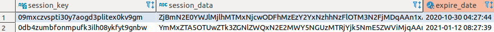

[그림 5] session_data 컬럼에 base64로 인코딩 되어 저장

# 로그인 후, 서비스 요청 (시퀀스 다이어그램)

Unscoped 토큰은 신분만 증명할 뿐, 서비스(e.g. Nova)에 서비스를 요청할 수 없습니다. 다시말해, 서비스를 요청하기 위해서는 endpoint와 범위가 지정되어 있는 Scoped 토큰이 필요합니다. Horizon은 Scoped 토큰을 얻기 위해 Session에 저장되어 있는 Unscoped 토큰으로 Keystone에게 Scoped 토큰을 요청합니다. Unscoped 토큰이 검증되어 Scoped 토큰이 성공적으로 발급되면 서비스를 요청할 수 있는 권한이 부여됩니다. 다시, Horizon은 서비스 요청 내용과 Scoped 토큰을 함께 서비스에게 보냅니다.

> An unscoped token contains neither a service catalog, any roles, a project scope, nor a domain scope. Their primary use case is simply to prove your identity to keystone at a later time (usually to generate scoped tokens), without repeatedly presenting your original credentials.

이후, 서비스는 Horizon이 보내온 Scoped 토큰을 검증하기 위해 Keystone에게 검증 의뢰를 합니다. 토큰 검증에 문제가 없다면 사용자의 서비스 요청을 실행합니다. 요청이 완료되면 그 결과를 사용자에게 보고합니다.

아래는 로그인 후, 서비스 요청 과정에 대한 다이어그램입니다.

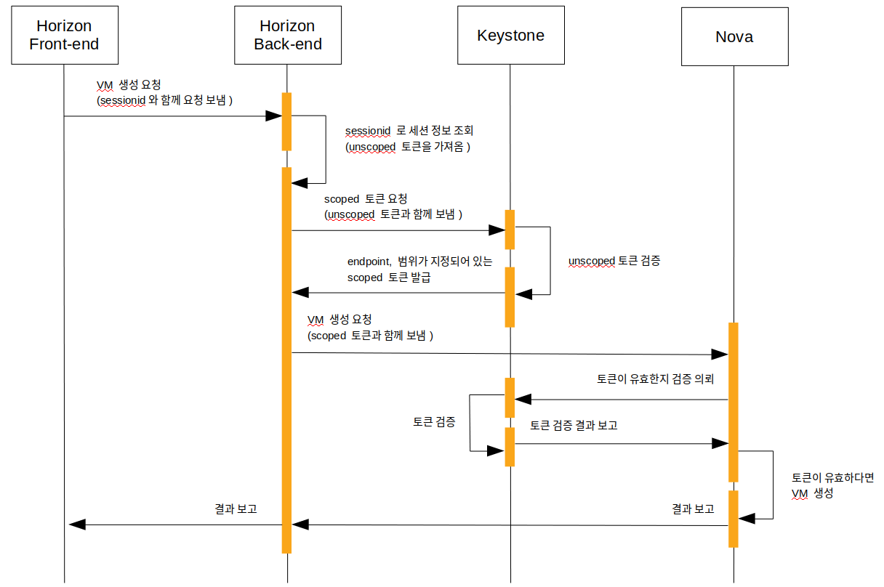

[그림 6] 로그인 후, 서비스 요청 시퀀스 다이어그램

# Django Session

Session 기반 인증에서 Session 저장소의 위치는 중요한 이슈사항이 됩니다. 로드밸런서에 의해 트래픽이 분산되는 환경일 때, 서버 각각 Session 저장소를 분리되어 있으면 Session의 정보를 공유하고 있지 않아 사용자를 식별할 수 없는 문제가 발생됩니다.

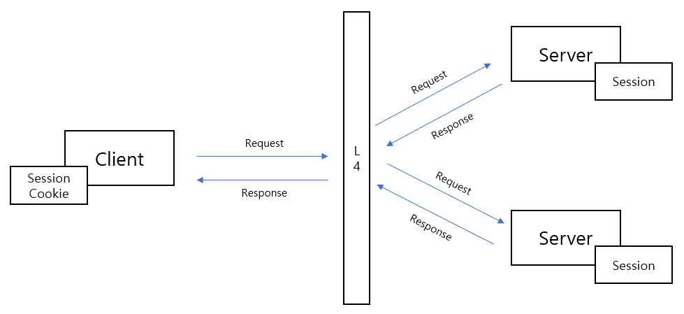

[그림 7] 노드 각각 Session 저장소를 분리할 경우, 트래픽 분산 시 사용자를 식별할 수 없음

때문에, Django Session은 기본 설정으로 한 곳의 데이터베이스에 Session 정보를 저장하도록 되어 있습니다.

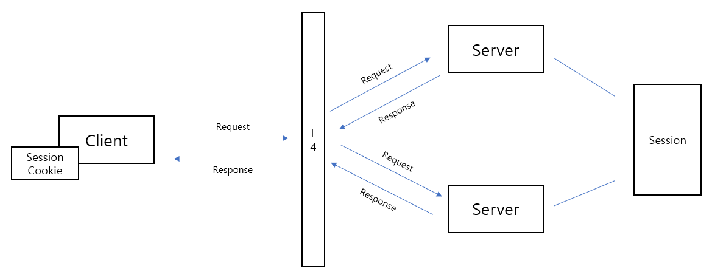

[그림 8] Django Session은 한 곳의 데이터베이스에 Session 정보를 저장 (Session의 정보를 공유하고 있기에 사용자 식별이 유지됨)

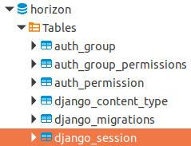

[그림 9] horizon 데이터베이스에 django_session 테이블에 저장

## Session Cookie

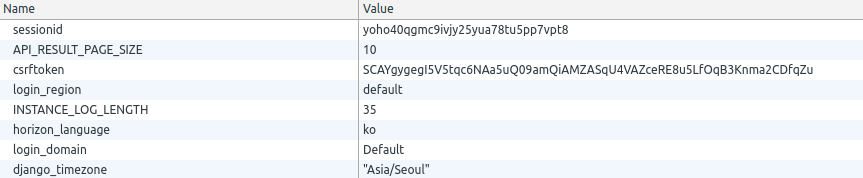

[그림 10] 쿠키에 저장되는 sessionid

클라이언트는 sessionid를 쿠키로 저장합니다. 그리고 서버 요청 시 쿠키에 저장된 sessionid와 함께 보내, 서버가 사용자를 식별할 수 있도록 합니다. 만약, sessionid Name을 가진 쿠키를 지우게 되면 서버는 사용자를 식별할 수 없어 로그인이 풀리게 됩니다.

다만, 로그아웃과 달리 세션 정보를 지운 것이 아니기 때문에 예전 sessionid 값을 다시 쿠키에 담아 요청하면 다시 로그인을 유지할 수 있습니다. 아래는 이에 대한 시나리오입니다.

#### - 쿠키를 제거하고 새로고침

사용자를 식별할 수 없어 로그인이 풀림.

#### - 쿠키를 이전 값으로 설정하고 새로고침

```
{
  Name: sessionid
  Value: yoho40qgmc9ivjy25yua78tu5pp7vpt8
  Expires / Max-Age: 2021-02-17T08:00:20.116Z
}
```

인증이 유지됨.

#### 참고 사항

> sessionid 값을 다시 쿠키에 담고 새로고침할 때 URL이 중요합니다.
>
> http://localhost/auth/login/
> 의 URL에서는 성공적으로 인증이 이루어지지만,
>
> http://localhost/auth/login/?next=/project/
> next 쿼리 스트링이 존재하면
> 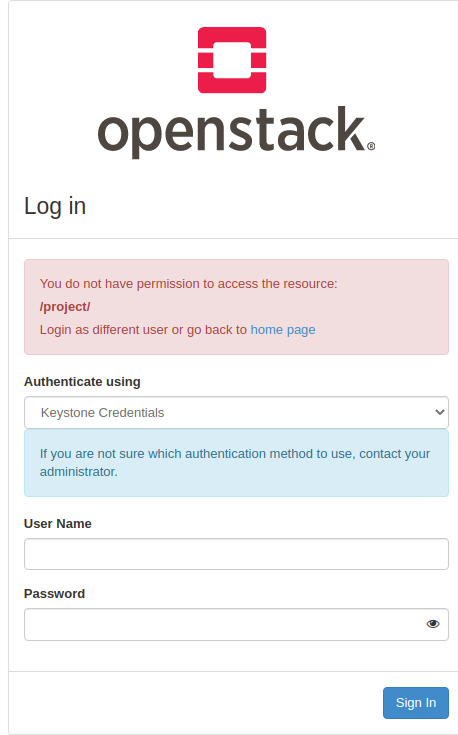
> 에러를 발생시킵니다.

#### base64로 디코딩한 Session 정보

```
1ef052cd5f350f2437dc34bc3026fc722b98ffb1:�}q(Uunscoped_tokenU�gAAAAABgLMgIMtPsvMIBf4vH7kapIzHVaWItsBMFjRb4TAkKgr4rVPUhVXCG6YPkDp5OuRUHlVBcDtPEUv3cpaQgjefoM5Y4zCs__6myyolZ-COyoJaFDKykgQ_F5oo7cN74J9DteTMiQio298r5O-23JeYTfdZWBgqUuser_idX 2d9eb8b0ca4f4abc8bfb74cbf8ae5238qU
region_namecdjango.utils.functional
_lazy_proxy_unpickle
q(cdjango.utils.translation
ugettext
qUDefault Region�q}qc__builtin__
unicode
_auth_user_idhUregion_endpointXttp://172.16.0.250:5000/v3q
Uservices_regionX       RegionOneq
U
usage_startU
2021-02-16U_auth_user_backendU&openstack_auth.backend.KeystoneBackendU  usage_endU
2021-02-17Utokencopenstack_auth.user
Token
q
}q(Uunscoped_tokenqhUdomainq}q(UidqNUnameqNuUserviceCatalogq]q(}q(X     endpointsq]q(}q(XurlqXhttp://172.16.0.250:8042X interfaceqXttp://210.207.104.171:8042hXhttp://172.16.0.250:8042hX<http://172.16.0.250:8776/v2/273795270dc5449baf47b1dfbca19170hX?http://210.207.104.171:8776/v2/3b7d443449b64cf89e4d37a20b04a407hX<http://172.16.0.250:8776/v2/273795270dc5449baf47b1dfbca19170hXhttp://172.16.0.250:9292hXhttp://172.16.0.250:9292hXttp://210.207.104.171:9292hX?http://210.207.104.171:8774/v2/3b7d443449b64cf89e4d37a20b04a407hX<http://172.16.0.250:8774/v2/273795270dc5449baf47b1dfbca19170hX<http://172.16.0.250:8774/v2/273795270dc5449baf47b1dfbca19170hXhttp://172.16.0.250:9876hXttp://210.207.104.171:9876hXhttp://172.16.0.250:9876hX>http://172.16.0.250:8774/v2.1/273795270dc5449baf47b1dfbca19170hXAhttp://210.207.104.171:8774/v2.1/3b7d443449b64cf89e4d37a20b04a407hX>http://172.16.0.250:8774/v2.1/273795270dc5449baf47b1dfbca19170hXhttp://172.16.0.250:9696hXhttp://172.16.0.250:9696hXttp://210.207.104.171:9696hXhttp://192.168.140.250:35357hXttp://210.207.104.171:5000hXhttp://172.16.0.250:5000hX?http://210.207.104.171:8004/v1/3b7d443449b64cf89e4d37a20b04a407hX<http://172.16.0.250:8004/v1/273795270dc5449baf47b1dfbca19170hX<http://172.16.0.250:8004/v1/273795270dc5449baf47b1dfbca19170hXttp://210.207.104.171:8041hXhttp://172.16.0.250:8041hXhttp://172.16.0.250:8041hXttp://210.207.104.171:8082hXhttp://172.16.0.250:8082hXhttp://172.16.0.250:8082hXhttp://172.16.0.250:8780hXhttp://172.16.0.250:8780hXttp://210.207.104.171:8780hXhttp://210.207.104.171:8000/v1hXttp://172.16.0.250:8000/v1hXttp://172.16.0.250:8000/v1hX<http://172.16.0.250:8776/v3/273795270dc5449baf47b1dfbca19170hX?http://210.207.104.171:8776/v3/3b7d443449b64cf89e4d37a20b04a407hX<http://172.16.0.250:8776/v3/273795270dc5449baf47b1dfbca19170h&0ciso8601.iso8601
Utc
qo)Rqp�RqqU
is_federatedqr�Uprojectqs}qt(hXhhjangquU     domain_idXdefaultUis_admin_project�hX 273795270dc5449baf47b1dfbca19170qvuUuserqw}qx(Upassword_expires_atNhhhXadminqyuUidqzU�gAAAAABgLMgI5Ms6zzPhNZkJcK1yTR32aIjKYCBeNhA2aIMnc6R4350OFmUP5WmKO83KI45-Uh_mUBMRmHzoTHJ9x-B8kaq_mmS0hEKFzuRXRniDvnavIPLV8BOlRJGuEItrEK-WGWs4XDJ_SunDXgazWKPAipOWZqPTLKP2hgY413HvLi8I86buGyDYnFQP25WRygWu1UHvUtenantq{htubX_session_expiryMU_auth_user_hashU(506d93b80b3981000edb8e3e0552d17645989327u.
```

base64로 디코딩한 Session 정보를 확인해보면 unscoped_token 값이 저장되어 있는 것을 확인할 수 있습니다.

## 로그아웃

로그아웃 역시 Django 인증 시스템을 이용합니다. logout_then_login() 은 로그아웃 후 다시 로그인 페이지로 이동시키는 django.contrib.auth.views 모듈의 함수이며 Session 정보를 데이터베이스에서 삭제합니다. 여기서 중요한 점은, Session에 저장되어 있던 Unscoped 토큰은 무효화 처리하지 않는다는 점입니다. (로그아웃 시 Unscoped 토큰을 무효화한 후 세션 정보를 지우는 것이 아니라 단순히 세션 정보를 DB에서 삭제)

#### horizon/openstack_auth/views.py

```python
def logout(request, login_url=None, **kwargs):
  """Logs out the user if he is logged in. Then redirects to the log-in page.

  :param login_url:
      Once logged out, defines the URL where to redirect after login

  :param kwargs:
      see django.contrib.auth.views.logout_then_login extra parameters.

  """
  msg = 'Logging out user "%(username)s".' % \
      {'username': request.user.username}
  LOG.info(msg)

  """ Securely logs a user out. """
  if (utils.is_websso_enabled and utils.is_websso_default_redirect() and
        utils.get_websso_default_redirect_logout()):
    auth_user.unset_session_user_variables(request)
    return django_http.HttpResponseRedirect(
        utils.get_websso_default_redirect_logout())
  else:
    return django_auth_views.logout_then_login(request,
                                                login_url=login_url,
                                                **kwargs)
```

참고

---

- https://galid1.tistory.com/207
- https://docs.djangoproject.com/en/3.1/topics/http/sessions/
- https://documentation.suse.com/hpe-helion/8/html/hpe-helion-openstack-clm-all/ops-managing-identity.html
- https://zenodo.org/record/34463/files/SummerStudentReport-PawelPamula.pdf?download=1
