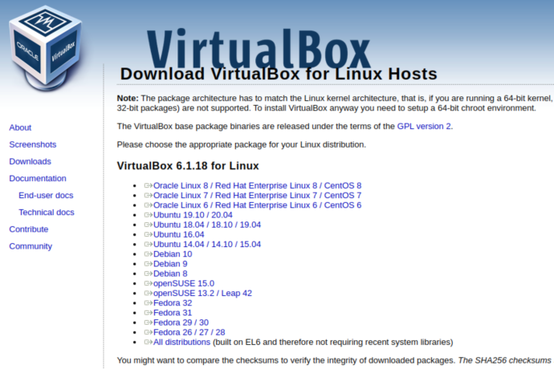

## VirtualBox 기본 설정

### VirtualBox 다운로드


https://www.virtualbox.org/wiki/Downloads 에서 PC의 OS에 맞는 VirtualBox 설치 파일을 다운로드 받습니다. (본 글은 Ubuntu 18.04 기준으로 설명하며, 설치 과정은 동일합니다!)

VirtualBox 6.1.18 platform packages > Linux distributions 링크를 클릭합니다.



Ubuntu 18.04 / 18.10 / 19.04 링크를 클릭해 설치파일을 다운로드합니다.


VirtualBox 6.1.18 Oracle VM VirtualBox Extension Pack > All supported platforms 링크를 클릭합니다.


VirtualBox 설치 파일과 Extension Pack 파일이 정상적으로 다운로드 되었는지 확인합니다.

### VirtualBox 설치


virtualbox-6.1_6.1.18-142142_Ubuntu_bionic_amd64.deb 파일을 설치합니다.

### VirtualBox Extension 설치


VirtualBox 메인 화면에서 File > Preferences 를 클릭합니다.


Extensions 탭 클릭 후 Version 우측에 있는 [+] 모양의 아이콘을 클릭합니다.


Oracle_VM_VirtualBox_Extension_Pack-6.1.18.vbox-extpack 파일을 선택합니다.


Install을 진행합니다.


성공적으로 Extension이 추가되었는지 확인합니다.

### VirtualBox VM 생성 (Ubuntu 18.04)


Machine > New 클릭합니다.


```
Name: OpenStack (임의로 작성 가능)
Type: Linux
Version: Ubuntu (64-bit)
```

으로 설정하고 [Next] 를 클릭합니다.


Memory size는 최소 2 GB 이상 설정을 권장합니다.
Memory size를 설정하고 [Next] 를 클릭합니다.


가상 하드 드라이브를 만듭니다.


가상 하드 디스크 파일 타입을 VDI(VirtualBox Disk Image)로 설정하고 [Next]를 클릭합니다.


- Dynamically allocated (동적 할당)
- Fixed size (고정 할당)

두가지 방식으로 가상 하드 디스크를 만들 수 있습니다.

동적할당의 경우 실제 사용량 만큼만 파일이 커지기 때문에 호스트 컴퓨터 (VirtualBox가 설치된 컴퓨터) 용량을 낭비없이 효율적으로 사용할 수 있는 장점이 있지만, 고정 크기 방식에 비해 속도가 떨어지는 단점이 있습니다.


가상 하드 디스크의 크기를 입력하고 생성합니다. (최소 8 GB 이상)


Storage > Contoller: IDE
IDE Secondary Device 0: [Optical Drive] Empty 를 클릭합니다.


Ubuntu 18.04 Server 이미지를 선택합니다.

## VirtualBox 네트워크 설정

### VirtualBox Host Network 설정


File > Host Network Manager를 클릭합니다.


새로운 Host Network를 구성하기 위해 Create를 클릭합니다.


```
IPv4 Address: 192.168.56.1
IPv4 Network Mask: 255.255.255.0
```

으로 설정합니다.

> [참고]
>
> 
>
> (VirtualBox가 설치되어 있는 호스트 컴퓨터에서 어댑터 정보를 확인해보면 VirtualBox Host-Only Network 어댑터로 IPv4가 192.168.56.1 로 설정되어 있는 것을 확인할 수 있습니다.)

### VirtualBox Adapter 설정

OpenStack은 내부 통신을 위한 Internal용 NIC, 외부 통신을 위한 External용 NIC, 최소 2개 이상의 물리 NIC을 필요로 합니다. VirtualBox에서 제공하는 Adapter 설정을 통해 VM에 여러개의 물리 NIC이 연결된 것처럼 구성할 수 있습니다.


```
[VirtualBox Adapter]
Adapter1: 내부 통신용 NIC
Adapter2: 외부 통신용 NIC (Bridge)
Adapter3: NAT
```

```
[Ubuntu]
enp0s3: (host-only) Internal
(Adapter1이 Ubuntu VM에서 enp0s3로 설정됨)

enp0s8: (Bridge) External
(Adapter2가 Ubuntu VM에서 enp0s8로 설정됨)

enp0s9: (NAT)
(Adapter3가 Ubuntu VM에서 enp0s9로 설정됨)
```


Name: Host Network Manager에서 만들었던 설정 이름으로 선택합니다.
Promiscuous Mode: Allow All로 설정합니다.


Promiscuous Mode: Allow All로 설정합니다.


