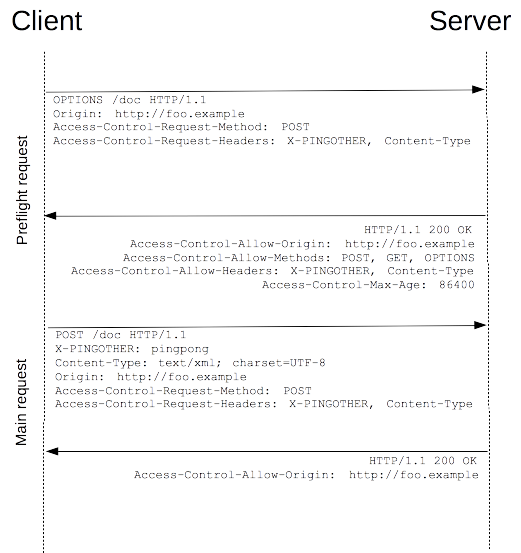
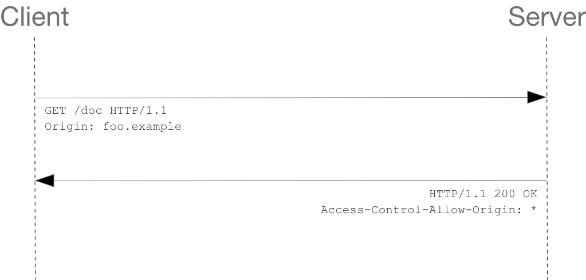

# CORS (Cross-Origin Resource Sharing)

## 1. CORS 개요

CORS (교차 출처 자원 공유)는 보안 상의 이유로, JavaScript에서 보내는 교차 출처 (자신과 다른 출처) HTTP 요청을 제한하기 위한 정책입니다. 대다수 브라우저에는 CORS가 적용되어 있는데, 이는 자신의 출처와 동일한 리소스만 불러올 수 있도록 하여, 악의적인 자원 접근과 탈취를 막기 위함입니다.

## 2. CORS 에러

웹을 개발하면서 아래와 같은 에러 메시지를 한번쯤 보셨을 것 같습니다. CORS 에러가 발생하는 이유는 [CORS 개요]에서 소개했듯이, JavaScript 코드 상에서 동일한 출처가 아닌 곳에서 요청을 하였기 때문입니다. 아래의 에러 내용을 살펴보면 "http://localhost:3000 출처에서 보낸 https://www.example.com 의 자원 접근 요청을 CORS 정책에 의해 차단되었습니다." 라는 문구를 확인할 수 있습니다.

> Access to fetch at ‘http://www.example.com’ from origin ‘http://localhost:3000’ has been blocked by CORS policy: No ‘Access-Control-Allow-Origin’ header is present on the requested resource. If an opaque response serves your needs, set the request’s mode to ‘no-cors’ to fetch the resource with CORS disabled.

```js
/*
 * main.js
 * local에서 main.js가 http://www.example.com에 데이터를 요청함
 * 출처가 다르기 때문에 CORS 에러 발생
 */

$.get('http://www.example.com', function(data) {
  alert('Data Loaded: ' + data)
})
```

## 3. CORS 동작 과정

CORS는 브라우저에서 이루어집니다. 때문에, 브라우저의 옵션을 수정하면 CORS를 회피할 수 있습니다. 예를 들어, 크롬 브라우저에서 --disable-web-security 옵션을 추가하면 CORS 에러 없이 여러 출처의 리소스에 대해 접근할 수 있습니다.

그렇다면, 브라우저는 어떻게 CORS를 동작하고 있을까요? CORS는 Preflight Request, Simple Request 두 가지 방식으로 동작됩니다. Preflight Request, Simple Request에 대해 한번 알아봅시다.

### 3.1. Preflight Request

본 요청을 보내기 이전에 보내는 예비 요청을 Preflight라고 부릅니다. Preflight는 HTTP의 OPTIONS 메소드를 이용해 서버에 보내집니다. 이러한 예비 요청을 통해 본 요청을 보내기 전, CORS를 위반하고 있는지를 확인합니다. Preflight에 대한 서버 응답이 안전하다면 브라우저는 본 요청을 서버에 다시 보냅니다.



[그림 1] Preflight Request 동작

### 3.2. Simple Request

Simple Request (단순 요청)는 Preflight Request 방식과 달리 예비 요청을 보내지 않습니다. 대신 Access-Control-Allow-Origin 헤더를 이용해 CORS 위반 여부를 검사합니다.
클라이언트의 요청에 대해 서버는 Access-Control-Allow-Origin 헤더와 함께 응답합니다. Access-Control-Allow-Origin 헤더에는 CORS 정책이 담겨있고, 브라우저는 Access-Control-Allow-Origin 헤더의 내용을 토대로 정책을 위반했는지 확인합니다. 이상이 없다면 본 요청을 서버에 보냅니다.



[그림 2] Simple Request 동작

### 4. CORS 해결 방법

CORS는 서버, 클라이언트 한쪽만 의 적용으로 해결할 수 있습니다. 서버, 클라이언트 각각에서 CORS를 처리하는 대표적인 방법 두 가지를 소개합니다. (다만, 서버에서 CORS 정책을 제어하는 것을 권장합니다.)

#### 4.1. @CrossOrigin 어노테이션 이용 (API)

스프링 기준, 스프링 4.2 이상부터 지원되는 @CrossOrigin을 이용하여 CORS 정책을 설정할 수 있습니다. Controller에 어노테이션을 추가하면 적용됩니다.

- @CrossOrigin : 모든 도메인, 모든 요청 방식에 대해 허용
- @CrossOrigin(origins = "http://www.example1.com, http://www.example2.com")
  - http://www.example1.com, http://www.example2.com 도메인에 대해서만 허용

```java
@CrossOrigin
public class ProjectController {

    @GetMapping(value="/projects/list", produces = "application/hal+json")
    public ResponseEntity<List<Project>> getProjectList(@ModelAttribute KeystoneProject project){
        return ResponseEntity.ok(projectService.getProjectList(project));
    }

}
```

#### 4.2. 프록시 이용 (Client)

CORS 에러는 근본적으로 자신과 다른 출처에서 HTTP 요청을 하였을 때 발생한다는 점을 기억해 보면, 자신의 출처를 프록싱하면 CORS를 회피할 수 있을 것 같습니다. 클라이언트는 이 같은 아이디어로 CORS 에러를 해결합니다. 프록싱을 통해 자신의 출처를 CORS가 허용되는 출처로 바꿔 HTTP 요청을 하는 것이죠. 프록싱을 하면 최소한의 설정으로 CORS를 회피할 수 있어 개발 시 이용되곤 합니다.

## 참고

- https://medium.com/@buddhiv/what-is-cors-or-cross-origin-resource-sharing-eccbfacaaa30
- https://developer.mozilla.org/ko/docs/Web/HTTP/CORS
- https://evan-moon.github.io/2020/05/21/about-cors/#preflight-request
